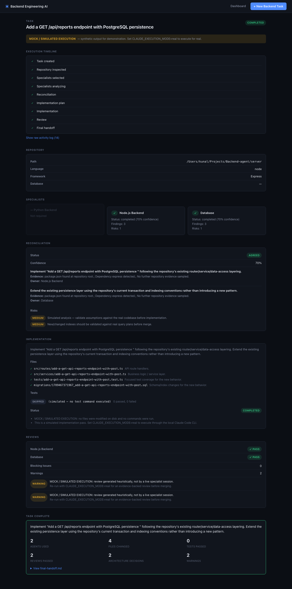
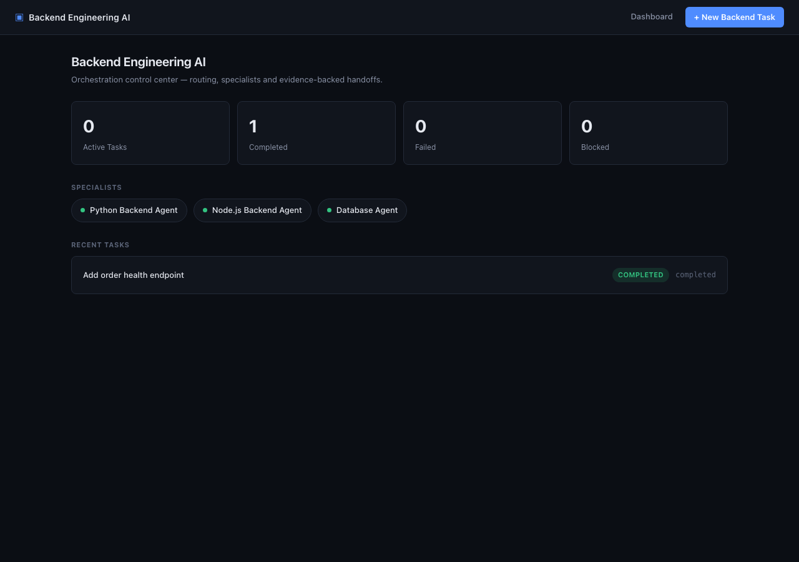
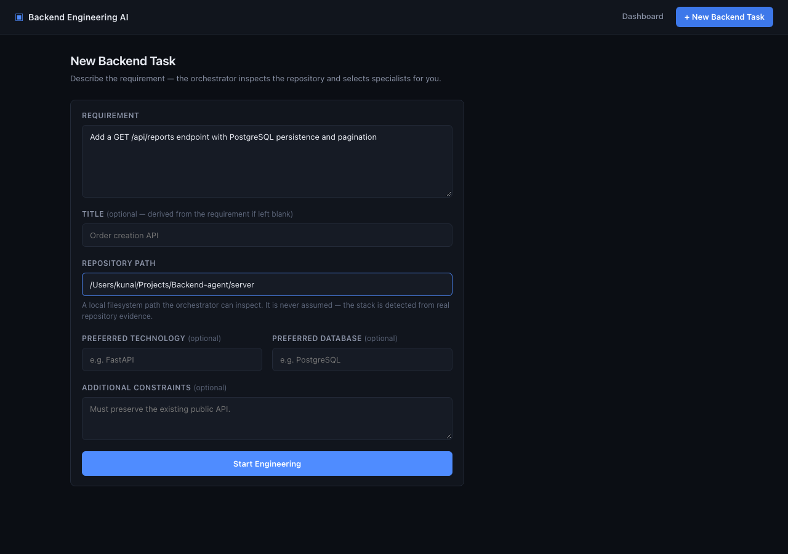

<div align="center">

# Backend Engineering Agent Platform

**An AI engineering control center for backend work.**
Describe a requirement, point it at a real repository, and watch an orchestrator inspect the codebase, route the right specialists, reconcile their recommendations, implement the change, and hand you back evidence — not just a claim.

[](https://nodejs.org)
[](https://www.typescriptlang.org/)
[](https://expressjs.com/)
[](https://angular.dev/)
[](#testing)

</div>

<br>



## What it is

```
Developer → Web UI → Orchestrator API → Repository Inspection → Agent Routing
   → Specialists (Python / Node / Database) → Reconciliation → Implementation Plan
   → Claude Code Execution → Reviews → Final Handoff
```

You describe a backend requirement in plain English and point it at a real local repository. The orchestrator:

- inspects the actual repository — language, framework, database, test commands — rather than guessing from your description,
- routes only the specialists the task needs (Python, Node.js, Database — never all three by default),
- reconciles their recommendations into one plan, flagging conflicts instead of silently picking a side,
- hands the reconciled plan to Claude Code to implement,
- runs the specialist reviews, sending blocking findings back for a bounded number of corrective passes,
- produces a final handoff with everything that happened — files changed, tests run, decisions made, risks disclosed.

Every stage is inspectable. Nothing is claimed that didn't actually happen.

## Features

- ✓ **Live execution timeline** over Server-Sent Events, with a full raw activity log for anyone who wants the receipts
- ✓ **Real repository inspection** — reads `package.json` / `requirements.txt` / `pyproject.toml`, not assumptions
- ✓ **Cross-stack routing engine** covering the full Python / Node / database routing matrix, including ambiguous-stack and cross-stack-migration cases
- ✓ **Artifact-first task workspaces** on disk (`tasks/<task-id>/`) — every specialist report, reconciliation, plan, execution report and review is a real inspectable file
- ✓ **Dual execution modes** — a safe, deterministic **mock** executor by default, and a **real** executor that drives the actual Claude Code CLI, opt-in only, never disguised as the other
- ✓ **Bounded review loop** — blocking findings return the task to implementation automatically, up to a configurable retry limit, instead of looping forever or completing regardless
- ✓ **56 automated tests** across the routing engine, repository inspector, reconciliation logic, API, SSE stream, and a full end-to-end happy path

## Screens

| Dashboard | New Task |
|---|---|
|  |  |

## Quick start

```bash
npm install
npm run dev
```

Open **http://localhost:4300**, click **+ New Backend Task**, point it at any local repository, and watch it run — in **mock mode** by default, so nothing on disk is touched until you opt in to real execution.

See [docs/LOCAL_DEVELOPMENT.md](docs/LOCAL_DEVELOPMENT.md) for environment variables, real-execution setup, and troubleshooting, or the [README quick reference below](#run-the-first-example-task).

### Run the first example task

1. Start the app and open the UI (above).
2. Requirement: `Add an order creation API with PostgreSQL persistence. Validate the request, use a transaction and add tests.`
3. Repository: an absolute path to a real local repo — this project's own `server/` directory works as a quick try.
4. **Start Engineering**, and watch the timeline, specialists, reconciliation, implementation, reviews and final handoff populate live.

## Tech stack

| Layer | Choice |
|---|---|
| Frontend | Angular 22 (standalone components, signals, zoneless change detection), TypeScript |
| Backend | Node.js, Express, TypeScript |
| Storage | JSON-file task store behind a swappable `TaskStore` interface (Postgres-ready) |
| Realtime | Server-Sent Events |
| Execution | Claude Code CLI (real) or a deterministic mock executor |
| Tests | Vitest (backend), Jest (frontend) |

## Project structure

```
server/    Express + TypeScript orchestrator API
web/       Angular standalone-component UI
tasks/     Per-task artifact workspaces (created at runtime)
data/      Lightweight JSON task index (created at runtime)
claude-code-platform-architecture-v0.1/   Specialist contracts, protocols, skills
docs/      Architecture, API, workflow, and project documentation
```

## Execution modes

| | Mock (default) | Real |
|---|---|---|
| Enabled by | nothing — this is the default | `CLAUDE_EXECUTION_MODE=real` |
| Touches your repository? | Never | Yes, during implementation |
| Test evidence | Simulated, clearly labeled | Real — runs your repo's actual test command |
| UI shows | 🟡 `MOCK / SIMULATED EXECUTION` | 🟢 `REAL EXECUTION` |

The platform never disguises which mode produced a result. Real mode is opt-in on purpose — automatically modifying a repository from a UI button click is exactly the kind of action that deserves an explicit decision, not a default.

## Testing

```bash
npm test              # everything (56 tests)
npm run test:server   # backend — vitest
npm run test:web      # frontend — jest
```

## Documentation

| Doc | What's in it |
|---|---|
| [docs/MVP_ARCHITECTURE.md](docs/MVP_ARCHITECTURE.md) | System design, task state machine, routing matrix, execution layer, security |
| [docs/API.md](docs/API.md) | Full REST + SSE API reference |
| [docs/AGENT_WORKFLOW.md](docs/AGENT_WORKFLOW.md) | How specialists, reconciliation and review actually work |
| [docs/LOCAL_DEVELOPMENT.md](docs/LOCAL_DEVELOPMENT.md) | Environment variables, setup, troubleshooting |
| [docs/MVP_IMPLEMENTATION_ASSESSMENT.md](docs/MVP_IMPLEMENTATION_ASSESSMENT.md) | How this was derived from the project's source design documents |
| [docs/MVP_COMPLETION_REPORT.md](docs/MVP_COMPLETION_REPORT.md) | What was built, tested, and what's next |

## Status

Functional MVP: the full pipeline runs end-to-end against real repositories, with a real mock/real execution boundary and a real test suite. Known limitations and the roadmap are tracked in [docs/MVP_COMPLETION_REPORT.md](docs/MVP_COMPLETION_REPORT.md#known-limitations).
